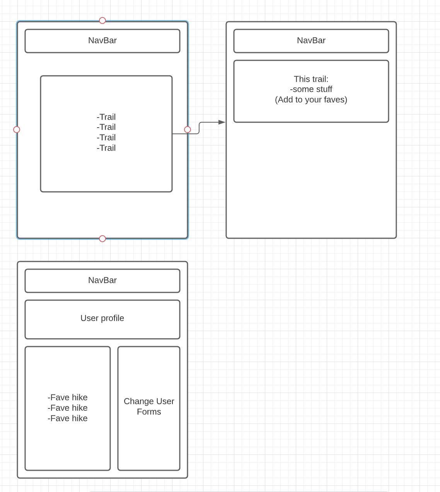

# Project 3 Pitch

## Fork & Clone this repo.

Review the [Project 3 requirements](https://tmdarneille.gitbook.io/sei-ga-sea/11-projects/project-3#project-feedback-evaluation) and check out some [examples](https://tmdarneille.gitbook.io/sei-ga-sea/11-projects/past-projects/project3).

Provide information in the following sections:

### Project Overview:
Our application will be a hiking app, providing a user with an opportunity to organize their hiking options. 

### Models
- User
- Trails

- Schemas
- User
	Name
	Email
	Password
	Location
	Radius from trail
	Nickname (optional)
{Favorite_trails
		API ID}
- Trails
	Id
	TrailName
	Location
	API ID

### User Stories

A user can log in and create an account, they will add to their account a location and a radius from that location to return trails.
-create user,
-return user 
-update location and/or radius
-delete nickname
	
Then the user can see trails for their parameters utilizing our api.
A user can select a trail to view details. On this page they can “fave”.
Favoriting the document will create a reference in the user’s account.
	-”create”: with adding a favorite.
	-”read”:  view all favorites?
	-”update”: search location
	-”delete”: remove a favorite
A user can save trails to their account.
The user can see their favorite trails on their profile.

### Wireframes

Additional Technologies
TrailAPI, possibly GoogleMaps API, MERN auth

### Work Allocation
	Gitmaster - Shane
	Scrum Master - Elaine
	Backend Engineer - Levin

### Daily Sprints

Friday: 
Elaine: test API, figure out key calls and values
Shane: Set up master git, check our branches
Levin: set up user schema in mern auth

Saturday:
Everyone: review code, identify pain points/sections that need help/general scrum!

Produce: testable routes in postman for api, user, and consolidate to master?

Sunday:
Day off, any checkins/time to meet with TAs.
Produce: standard language for our different data and calls to integrate branches.

Monday:
Elaine: renders for API calls
Shane: partials
Levin: posts
Produce: an app that *looks* functional, then integrate check data.

Tuesday:
AM meeting, scrum, review code, consolidate github
Produce: MVP, check for sore spots to scrum.

Wednesday:
AM meeting, review code, consolidate github
Sprint, make sure MVP!

Thursday:
Make it pretty.
-Look at stretch goals!
